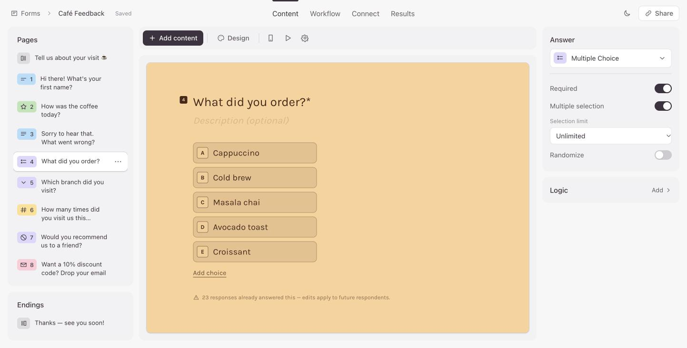
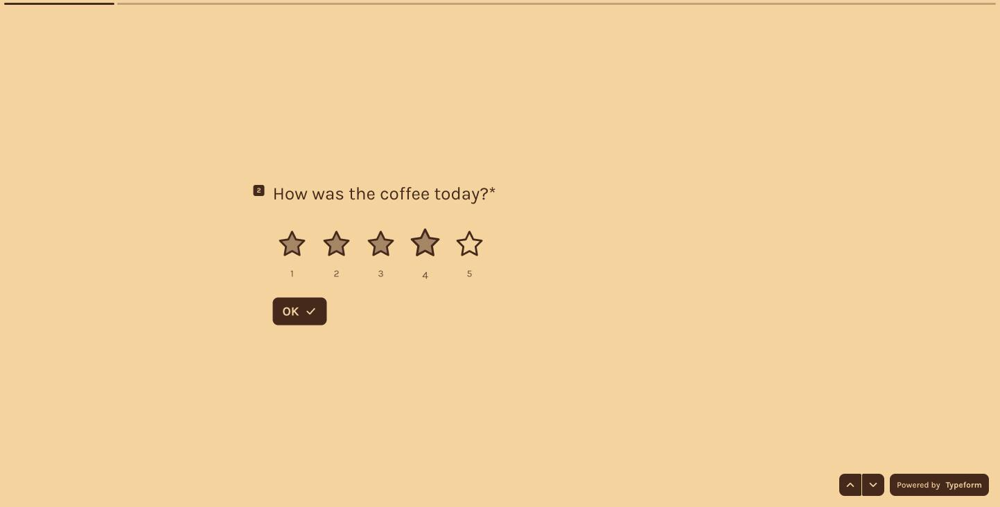
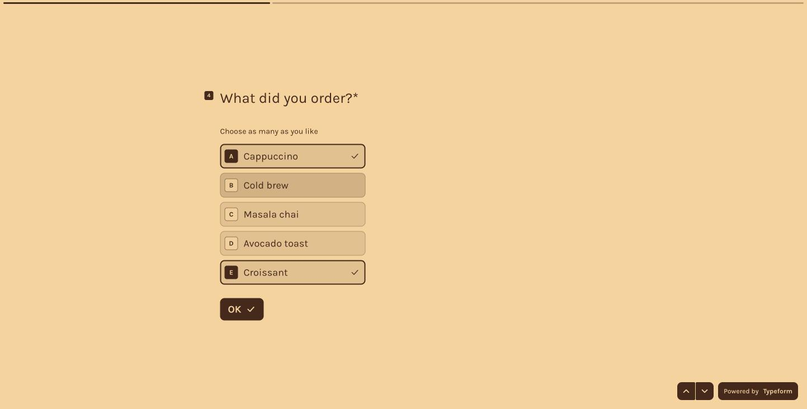
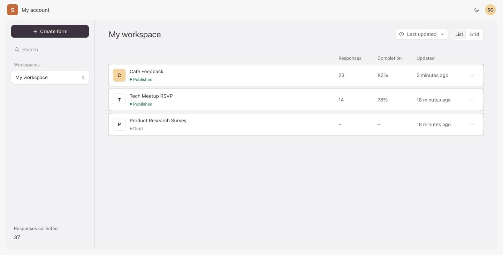
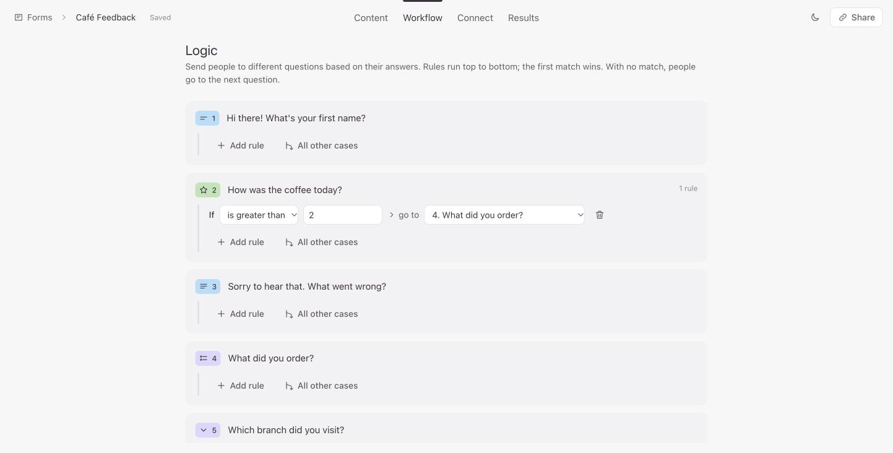
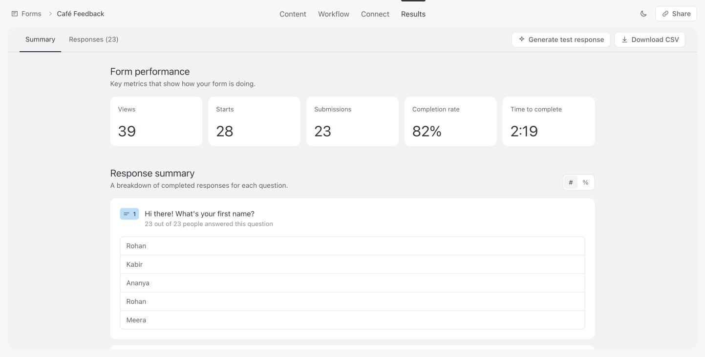
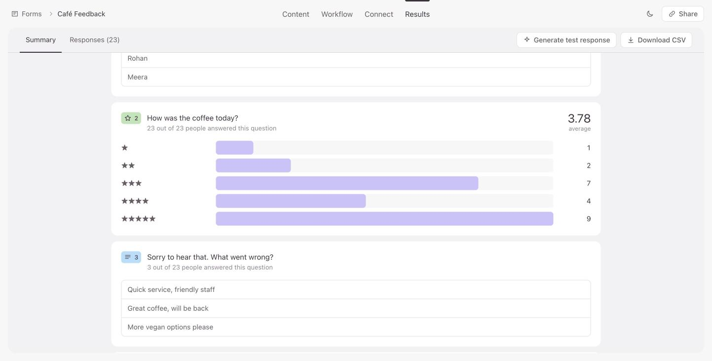
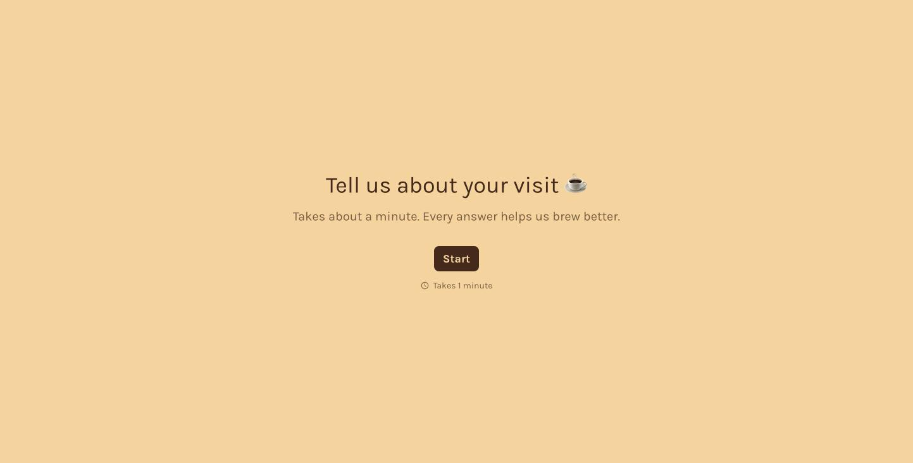
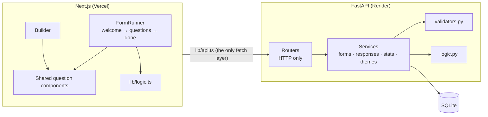
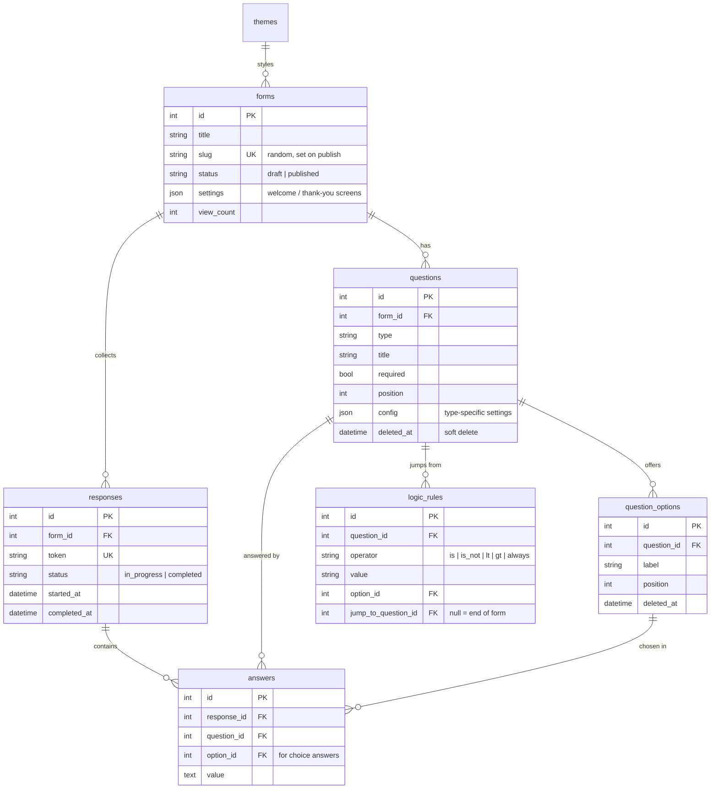

# Typeform Clone

**Build a form, share a link, and watch the answers come in.** This is a full-stack clone of Typeform: the three-panel builder, the one-question-at-a-time form, logic jumps, themes and analytics.

**[Open the live app](https://typeform-clone-ochre-psi.vercel.app)** · **[Fill in a real form](https://typeform-clone-ochre-psi.vercel.app/f/cafe-feedback)** · **[API docs](https://typeform-clone-api-okr0.onrender.com/docs)**



<table>
  <tr>
    <td></td>
    <td></td>
  </tr>
</table>

> The API runs on Render's free plan. If nobody has used it for a while, the first page can take up to a minute to load while the server wakes up. A GitHub Action pings it every 10 minutes so this rarely happens.

---

## Try it in 60 seconds

1. **[Fill in Café Feedback](https://typeform-clone-ochre-psi.vercel.app/f/cafe-feedback).** Use only the keyboard: <kbd>Enter</kbd> to continue, <kbd>A</kbd>–<kbd>E</kbd> to pick choices, <kbd>1</kbd>–<kbd>5</kbd> for stars.
2. **Rate the coffee 1 or 2 stars, and then 4 or 5 on a second try.** A low rating opens "Sorry to hear that. What went wrong?". A high rating skips it. That is a logic jump.
3. **Refresh halfway through.** Your answers are still there. The server has also saved them as a *partial response*.
4. **[Open the dashboard](https://typeform-clone-ochre-psi.vercel.app)** → Café Feedback → **Results.** Your response is counted, and the completion rate shows the people who started but never finished.
5. **Go to Workflow** and change the rule. Then go to **Content** and drag a question to a new position. Everything autosaves.

---

## What's in it

| Area | What you get |
| --- | --- |
| **Builder** | Three panels like Typeform's: pages, a live canvas and settings. You edit titles and choices directly on the canvas. Drag to reorder (mouse or keyboard). Duplicate, delete with a warning when a question already has answers, change a question's type in place, and edit the welcome and thank-you screens. Changes autosave with a *Saving… / Saved* indicator. |
| **9 question types** | Short text, long text, multiple choice (single or multi, with selection limit and randomise), searchable dropdown, email, number (min/max), yes/no, rating (stars, hearts, thumbs or circles; 3–10 steps) and file upload. |
| **Respondent flow** | One question per screen, with a progress bar. There is a full keyboard model (<kbd>Enter</kbd>, <kbd>⌘</kbd><kbd>Enter</kbd>, <kbd>↑</kbd><kbd>↓</kbd>, letter keys, <kbd>Y</kbd>/<kbd>N</kbd>, digits, <kbd>Shift</kbd><kbd>Enter</kbd>). Single-tap answers auto-advance. Errors show inline. Answers survive a refresh, and the layout works on mobile. |
| **Form management** | Dashboard with list and grid views, search and sort. Create, rename, duplicate and delete forms. Publish to a random, unguessable link, or unpublish. Toasts confirm each action. |
| **Results** | Views, starts, submissions, completion rate and average time to complete. Each question gets a summary (bars, averages, latest answers). There is also a paginated responses table with filters for completed, partial or all responses, plus CSV export and a "Generate test response" button. |

**Every bonus feature is done:** logic jumps · custom themes with Typeform's tabbed theme editor (font, title size and alignment, colours, corner radius, background image) with a 6-theme gallery · CSV export · partial responses and completion rate · file upload · dark mode for the admin side.

**Matched to the real thing.** I measured the following on live Typeform forms and in the Typeform builder, then reproduced them:

- the keyboard shortcuts;
- the 0.6 s auto-advance delay;
- the transition (the old question rises and fades in about 250 ms, then the new one springs in from a light blur);
- the progress bar;
- the error-pill colours;
- the admin colour tokens;
- the colour given to each question type.

<details>
<summary><b>More screenshots</b>: dashboard, logic jumps, results, welcome screen</summary>

| Dashboard | Logic jumps (Workflow tab) |
| --- | --- |
|  |  |
| **Results** | **Per-question summary** |
|  |  |
| **Welcome screen (Café theme)** | |
|  | |

</details>

---

## How it works



**The builder canvas and the public form render with the same components.** The preview can't drift from what respondents see, and adding a question type means one registry entry, one component and one validator.

**What happens when someone submits:**

1. The browser validates each answer as it is given, so feedback is instant.
2. Each confirmed answer is autosaved to a partial response (`PUT …/answers/{qid}`). A secret token proves this browser started that response.
3. On submit, the server **replays the logic rules** to work out which questions this person actually saw. It re-validates only those, drops answers to skipped questions and saves everything in one transaction.
4. If anything is wrong, it returns `422 {"errors": {"<question id>": "message"}}`, and the form jumps back to the first broken question.

Running the logic on the server is what lets a *required* question hidden by a jump stay out of the way of the submission.

---

## Database



There are three choices worth explaining:

- **An answer stores the option's *id*, not its text.** If you rename "Cold brew" to "Cold brew (oat)", the old answers still point at it and the charts stay correct. For multi-select, each chosen option gets its own row. `UNIQUE(response_id, question_id, option_id)` prevents duplicate rows, and per-question stats are a single `GROUP BY`.
- **Questions and options with answers are soft-deleted.** Delete a question that 23 people answered, and their responses stay readable. The builder warns you before you do it.
- **Columns hold what's shared, JSON holds what's type-specific.** Every question has a title, a required flag and a position, so those are columns. "Max characters" or "rating steps" belong to only one type, so they live in `config`. The alternative is a table per question type (9 tables and lots of joins) or MongoDB, which the brief rules out by fixing SQLite.

Foreign keys are enforced (`PRAGMA foreign_keys=ON`), deletes cascade from forms and responses, and all times are stored in UTC.

---

## Design decisions

| I chose | Over | Because |
| --- | --- | --- |
| Small autosave endpoints (one question, one reorder) | `PUT` the whole form | Overwriting the whole form recreates rows and orphans existing answers. A per-question sequence number also stops a slow, older save from overwriting a newer edit. |
| Logic evaluated in **both** browser and server | Browser only | The browser needs it to navigate. The server needs it to know what was seen, and it shouldn't trust the browser. |
| Forward-only logic jumps (validated, `422`) | Any jump | Backward jumps can create infinite loops. Reordering removes rules that would point backwards. |
| A random 8-character public link | `/f/1` | Forms can't be enumerated. Drafts and missing forms return the same `404`. |
| A token on partial responses | Response id only | Ids are guessable, so the token proves ownership. It's compared in constant time. |
| Escaping CSV cells that start with `= + - @` | Raw values | Prevents formula injection when the export is opened in Excel. |
| Routers that only handle HTTP | Logic in route handlers | Every rule lives in `services/` and is testable without HTTP. |

**Assumptions.** There is a single creator account, since the brief puts authentication out of scope. Editing a published form affects future respondents only, and the builder says so when a question already has answers. Analytics count completed responses unless you filter for partial ones.

---

## Run it locally

```bash
# API → http://localhost:8000  (interactive docs at /docs)
cd backend
python -m venv .venv && source .venv/bin/activate
pip install -r requirements.txt
uvicorn app.main:app --reload

# Web → http://localhost:3000
cd frontend
npm install
echo "NEXT_PUBLIC_API_URL=http://localhost:8000" > .env.local
npm run dev

# Tests
cd backend && pytest
```

On first start, the database is created and seeded with 6 gallery themes and three forms:

- **Café Feedback**: 23 responses and a logic jump on the rating.
- **Tech Meetup RSVP**: 14 responses. Answering "No" ends the form.
- **Product Research Survey**: a draft.

Delete `backend/typeform.db` to start fresh.

| Env var | Used by | Default |
| --- | --- | --- |
| `DATABASE_URL` | API | `sqlite:///./typeform.db` |
| `UPLOAD_DIR` | API | `./uploads` |
| `CORS_ORIGINS` | API | `http://localhost:3000` (comma-separated) |
| `NEXT_PUBLIC_API_URL` | Web | `http://localhost:8000` |

<details>
<summary><b>Project layout</b></summary>

```
frontend/src/
  app/                    routes: / · /forms/[id]/edit · /forms/[id]/results · /f/[slug] (public, server-rendered)
  components/
    questions/            one component per question type, shared by the builder canvas and the public form
      registry.ts         type → label, icon, colour, auto-advance
    respondent/           FormRunner: a reducer state machine (welcome → question[i] → done)
    builder/              useFormEditor (all builder state and saves), PageList, Canvas, SettingsPanel, LogicEditor, DesignPanel
    dashboard/, results/  the admin pages
  lib/                    api.ts (the only place that calls the API), logic.ts, validate.ts, theme.ts, types.ts

backend/app/
  routers/                HTTP only: parse the request, call a service, return a status code
  services/               forms (publish, duplicate, option diffing, reorder) · responses · stats · themes · uploads · sample
  models.py, schemas.py   SQLAlchemy tables, Pydantic request/response shapes
  validators.py           per-type answer validation (a registry, like the frontend's)
  logic.py                logic-jump evaluation (mirrors frontend/src/lib/logic.ts)
  seed.py                 demo themes, forms and responses
```

</details>

<details>
<summary><b>API reference</b> (full interactive docs at <a href="https://typeform-clone-api-okr0.onrender.com/docs">/docs</a>)</summary>

| Method | Path | Purpose |
| --- | --- | --- |
| GET · POST | `/api/forms` | List forms with response counts · create |
| GET · PATCH · DELETE | `/api/forms/{id}` | Full form · rename, theme, settings · delete |
| POST | `/api/forms/{id}/duplicate` · `/publish` · `/unpublish` | Copy with remapped logic · go live · take offline |
| POST | `/api/forms/{id}/questions` | Add a question (optionally after another) |
| PUT | `/api/forms/{id}/questions/order` | Save drag-and-drop order (`409` if it doesn't list exactly the current questions) |
| PATCH · DELETE | `/api/questions/{id}` | Edit fields, options (diffed by id) and logic · soft-delete if answered |
| GET · POST · PUT · DELETE | `/api/themes` · `/api/themes/{id}` | Gallery and custom themes (gallery ones are read-only; a theme in use can't be deleted) |
| GET | `/api/forms/{id}/summary` | KPIs and per-question stats |
| GET | `/api/forms/{id}/responses?status=&page=` | Paginated responses |
| GET · DELETE | `/api/forms/{id}/responses/{rid}` | One response |
| GET | `/api/forms/{id}/responses/export.csv` | CSV export |
| POST | `/api/forms/{id}/responses/generate` | Add a random valid response that follows the logic |
| GET | `/api/public/forms/{slug}` | Published form only |
| POST | `/api/public/forms/{slug}/view` | Count a view |
| POST | `/api/public/forms/{slug}/responses/start` | Begin a partial response → id + token |
| PUT | `/api/public/forms/{slug}/responses/{rid}/answers/{qid}` | Autosave one answer |
| POST | `/api/public/forms/{slug}/responses` | Submit (validated along the logic path) |
| POST · GET | `/api/public/forms/{slug}/uploads` · `/api/files/{key}` | Upload a file (10 MB) · download it |

Status codes:

- `201` created, `204` no content
- `400` business rule (for example, publishing an empty form)
- `404` missing or unpublished
- `409` conflict
- `422` invalid input, with errors keyed by question id

</details>

---

## Tech stack

| Layer | Choice |
| --- | --- |
| **Frontend** | Next.js 15 (App Router), TypeScript, Tailwind CSS 4, motion (animations), dnd-kit (drag and drop), sonner (toasts) |
| **Backend** | Python 3.12, FastAPI, SQLAlchemy 2, Pydantic 2 |
| **Database** | SQLite |
| **Tests** | pytest and FastAPI TestClient. 15 API tests cover validation, logic paths, option renames, partial responses, reorder, CSV injection and upload path tricks. |
| **Hosting** | Vercel (web) and Render (API). `render.yaml` is a one-click blueprint. |

## Known limits and next steps

- **Free hosting resets the database** when the server restarts, and the demo data is reseeded. `render.yaml` describes the one-line switch to a persistent disk. For production I'd move to Postgres.
- **No migrations yet.** Tables are created on startup. Alembic would be the next step.
- **No frontend tests.** I checked the respondent flow and the builder with a scripted browser run (39 checks), but those checks aren't in the repo. I'd add Playwright tests for the respondent flow first.
- **No rate limiting** on public submit and upload endpoints.
- **Form versioning.** Edits to a live form apply immediately. Typeform-style per-publish snapshots would be the proper fix.
